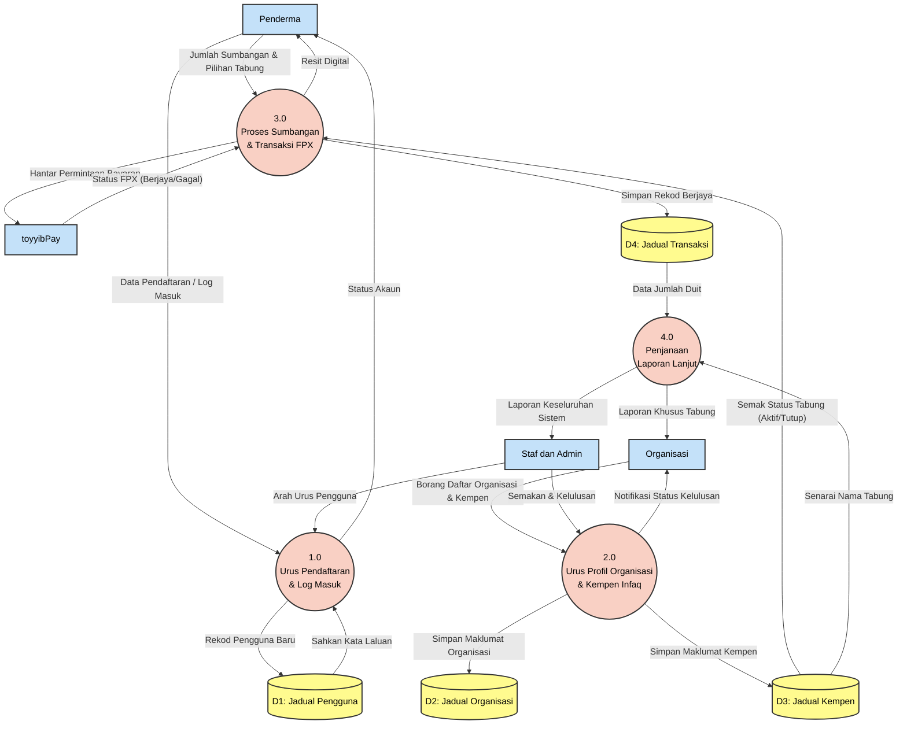

# Lakaran Rajah Aliran Data Tahap 1 (DFD Level 1) - Sistem MyInfaq

Rajah DFD Tahap 1 berfungsi untuk "memecahkan" bulatan utama (Sistem MyInfaq) dalam Rajah Konteks kepada beberapa proses atau modul yang lebih kecil. Dalam DFD Tahap 1 juga, kita mula memperkenalkan **Pangkalan Data (Data Store)**.

Berikut adalah kod Mermaid untuk DFD Level 1 anda:

