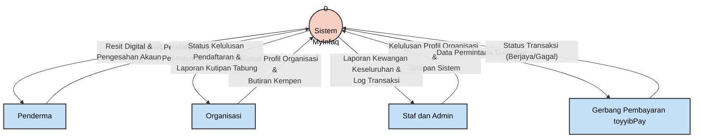

# Lakaran Rajah Konteks (DFD Tahap 0) - Sistem MyInfaq

Berikut adalah kod Mermaid untuk menghasilkan lakaran Rajah Konteks bagi sistem anda. Anda boleh letakkan kod ini di dalam mana-mana pemapar Markdown yang menyokong Mermaid untuk melihat rajahnya, atau jadikan rujukan semasa melukis di Microsoft Word/Draw.io.

